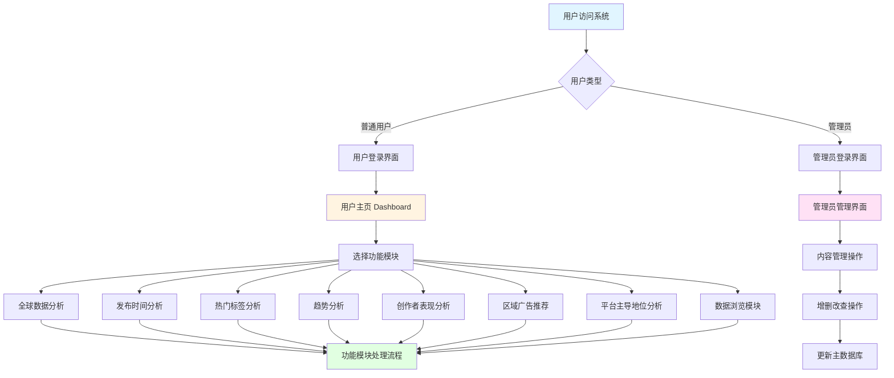
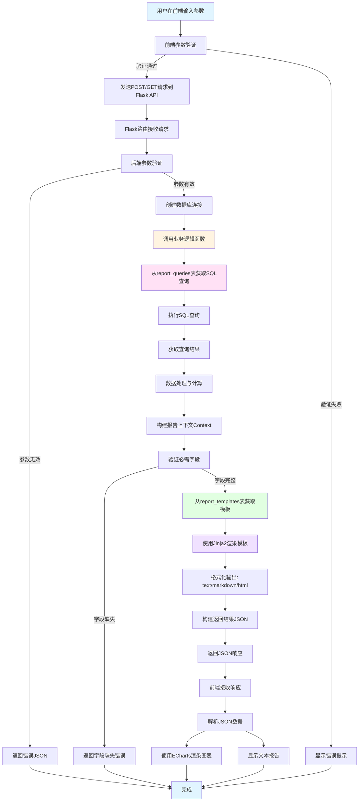
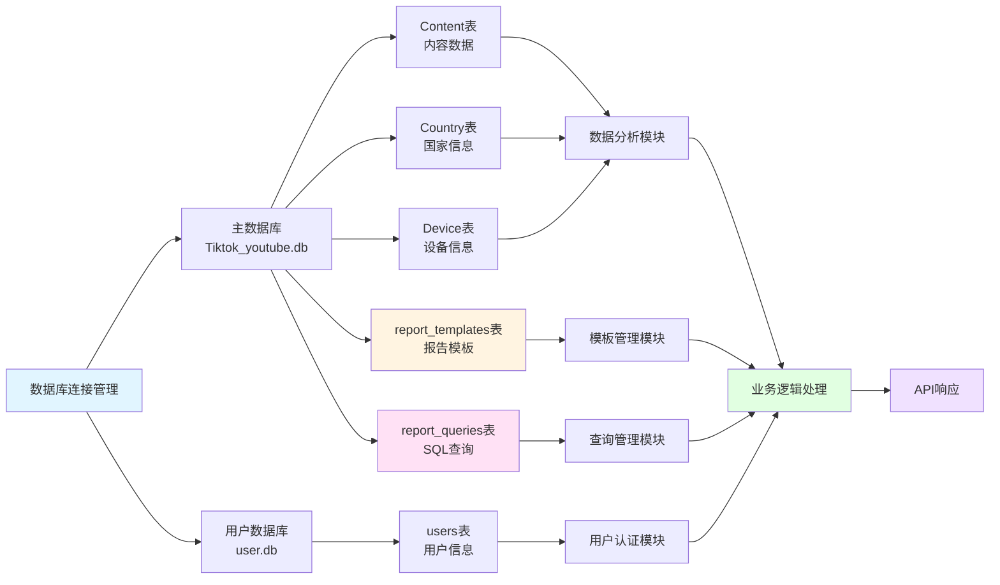
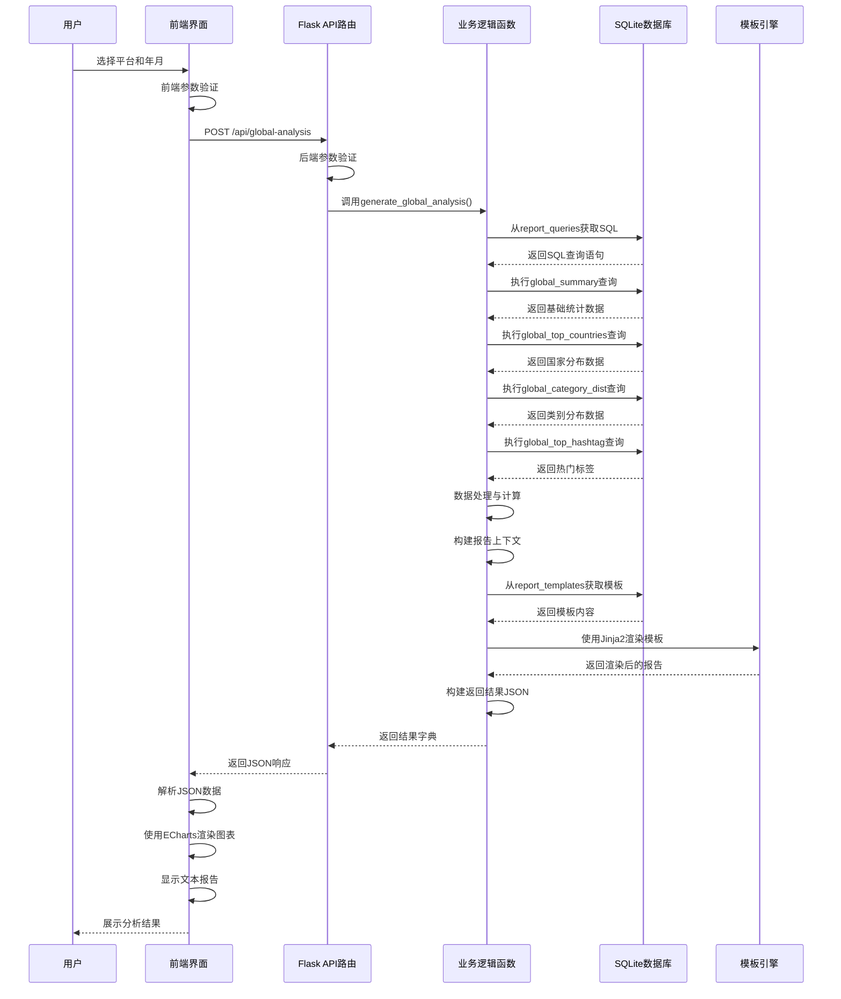
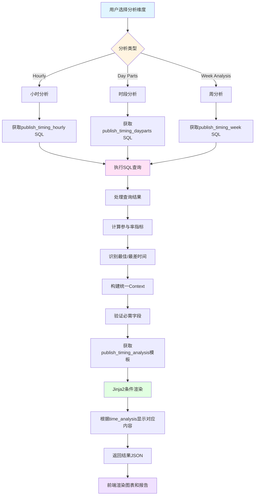
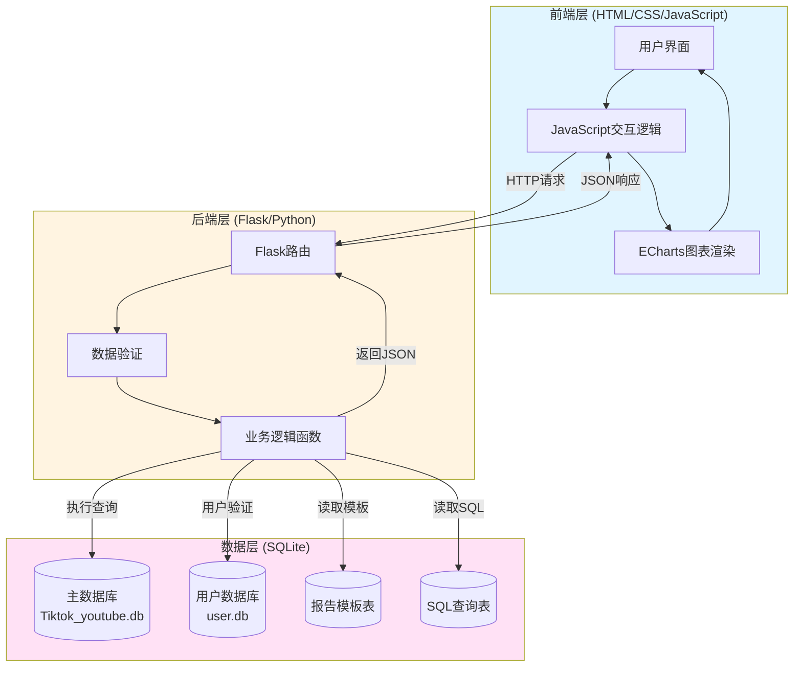

# 项目功能模块实现流程图

## 系统整体架构流程图

```mermaid
flowchart TD
    A[用户访问系统] --> B{用户类型}
    B -->|普通用户| C[用户登录界面]
    B -->|管理员| D[管理员登录界面]
    C --> E[用户主页 Dashboard]
    D --> F[管理员管理界面]
    
    E --> G[选择功能模块]
    F --> H[内容管理操作]
    
    G --> I1[全球数据分析]
    G --> I2[发布时间分析]
    G --> I3[热门标签分析]
    G --> I4[趋势分析]
    G --> I5[创作者表现分析]
    G --> I6[区域广告推荐]
    G --> I7[平台主导地位分析]
    G --> I8[数据浏览模块]
    
    I1 --> J[功能模块处理流程]
    I2 --> J
    I3 --> J
    I4 --> J
    I5 --> J
    I6 --> J
    I7 --> J
    I8 --> J
    
    H --> K[增删改查操作]
    K --> L[更新主数据库]
    
    style A fill:#e1f5ff
    style E fill:#fff4e1
    style F fill:#ffe1f5
    style J fill:#e1ffe1
```

## 功能模块详细处理流程

```mermaid
flowchart TD
    Start[用户在前端输入参数] --> Validate[前端参数验证]
    Validate -->|验证通过| API[发送POST/GET请求到Flask API]
    Validate -->|验证失败| Error1[显示错误提示]
    
    API --> Route[Flask路由接收请求]
    Route --> ParamCheck[后端参数验证]
    ParamCheck -->|参数无效| Error2[返回错误JSON]
    ParamCheck -->|参数有效| Connect[创建数据库连接]
    
    Connect --> Business[调用业务逻辑函数]
    Business --> GetSQL[从report_queries表获取SQL查询]
    GetSQL --> Execute[执行SQL查询]
    Execute --> Fetch[获取查询结果]
    
    Fetch --> Process[数据处理与计算]
    Process --> BuildContext[构建报告上下文Context]
    BuildContext --> ValidateFields[验证必需字段]
    
    ValidateFields -->|字段缺失| Error3[返回字段缺失错误]
    ValidateFields -->|字段完整| GetTemplate[从report_templates表获取模板]
    
    GetTemplate --> Render[使用Jinja2渲染模板]
    Render --> Format[格式化输出: text/markdown/html]
    Format --> BuildResult[构建返回结果JSON]
    
    BuildResult --> Return[返回JSON响应]
    Return --> Frontend[前端接收响应]
    Frontend --> Parse[解析JSON数据]
    Parse --> RenderChart[使用ECharts渲染图表]
    Parse --> DisplayReport[显示文本报告]
    RenderChart --> End[完成]
    DisplayReport --> End
    
    Error1 --> End
    Error2 --> End
    Error3 --> End
    
    style Start fill:#e1f5ff
    style Business fill:#fff4e1
    style GetSQL fill:#ffe1f5
    style GetTemplate fill:#e1ffe1
    style Render fill:#f0e1ff
    style End fill:#e1f5ff
```

## 数据管理模块流程图

```mermaid
flowchart LR
    A[数据库连接管理] --> B[主数据库<br/>Tiktok_youtube.db]
    A --> C[用户数据库<br/>user.db]
    
    B --> D[Content表<br/>内容数据]
    B --> E[Country表<br/>国家信息]
    B --> F[Device表<br/>设备信息]
    B --> G[report_templates表<br/>报告模板]
    B --> H[report_queries表<br/>SQL查询]
    
    C --> I[users表<br/>用户信息]
    
    G --> J[模板管理模块]
    H --> K[查询管理模块]
    I --> L[用户认证模块]
    
    D --> M[数据分析模块]
    E --> M
    F --> M
    
    M --> N[业务逻辑处理]
    J --> N
    K --> N
    L --> N
    
    N --> O[API响应]
    
    style A fill:#e1f5ff
    style G fill:#fff4e1
    style H fill:#ffe1f5
    style N fill:#e1ffe1
    style O fill:#f0e1ff
```

## 典型功能模块示例：全球数据分析流程

```mermaid
sequenceDiagram
    participant U as 用户
    participant F as 前端界面
    participant API as Flask API路由
    participant BL as 业务逻辑函数
    participant DB as SQLite数据库
    participant TM as 模板引擎
    
    U->>F: 选择平台和年月
    F->>F: 前端参数验证
    F->>API: POST /api/global-analysis
    API->>API: 后端参数验证
    API->>BL: 调用generate_global_analysis()
    
    BL->>DB: 从report_queries获取SQL
    DB-->>BL: 返回SQL查询语句
    BL->>DB: 执行global_summary查询
    DB-->>BL: 返回基础统计数据
    BL->>DB: 执行global_top_countries查询
    DB-->>BL: 返回国家分布数据
    BL->>DB: 执行global_category_dist查询
    DB-->>BL: 返回类别分布数据
    BL->>DB: 执行global_top_hashtag查询
    DB-->>BL: 返回热门标签
    
    BL->>BL: 数据处理与计算
    BL->>BL: 构建报告上下文
    BL->>DB: 从report_templates获取模板
    DB-->>BL: 返回模板内容
    BL->>TM: 使用Jinja2渲染模板
    TM-->>BL: 返回渲染后的报告
    
    BL->>BL: 构建返回结果JSON
    BL-->>API: 返回结果字典
    API-->>F: 返回JSON响应
    F->>F: 解析JSON数据
    F->>F: 使用ECharts渲染图表
    F->>F: 显示文本报告
    F-->>U: 展示分析结果
```

## 发布时间分析模块流程

```mermaid
flowchart TD
    A[用户选择分析维度] --> B{分析类型}
    B -->|Hourly| C[小时分析]
    B -->|Day Parts| D[时段分析]
    B -->|Week Analysis| E[周分析]
    
    C --> F[获取publish_timing_hourly SQL]
    D --> G[获取publish_timing_dayparts SQL]
    E --> H[获取publish_timing_week SQL]
    
    F --> I[执行SQL查询]
    G --> I
    H --> I
    
    I --> J[处理查询结果]
    J --> K[计算参与率指标]
    K --> L[识别最佳/最差时间]
    L --> M[构建统一Context]
    M --> N[验证必需字段]
    N --> O[获取publish_timing_analysis模板]
    O --> P[Jinja2条件渲染]
    P --> Q[根据time_analysis显示对应内容]
    Q --> R[返回结果JSON]
    R --> S[前端渲染图表和报告]
    
    style A fill:#e1f5ff
    style B fill:#fff4e1
    style I fill:#ffe1f5
    style P fill:#e1ffe1
    style S fill:#f0e1ff
```

## 系统数据流向图

```mermaid
flowchart TB
    subgraph Frontend["前端层 (HTML/CSS/JavaScript)"]
        UI[用户界面]
        JS[JavaScript交互逻辑]
        Chart[ECharts图表渲染]
    end
    
    subgraph Backend["后端层 (Flask/Python)"]
        Route[Flask路由]
        Logic[业务逻辑函数]
        Validate[数据验证]
    end
    
    subgraph Database["数据层 (SQLite)"]
        MainDB[(主数据库<br/>Tiktok_youtube.db)]
        UserDB[(用户数据库<br/>user.db)]
        Templates[(报告模板表)]
        Queries[(SQL查询表)]
    end
    
    UI --> JS
    JS -->|HTTP请求| Route
    Route --> Validate
    Validate --> Logic
    Logic -->|读取SQL| Queries
    Logic -->|执行查询| MainDB
    Logic -->|读取模板| Templates
    Logic -->|用户验证| UserDB
    Logic -->|返回JSON| Route
    Route -->|JSON响应| JS
    JS --> Chart
    Chart --> UI
    
    style Frontend fill:#e1f5ff
    style Backend fill:#fff4e1
    style Database fill:#ffe1f5
```

